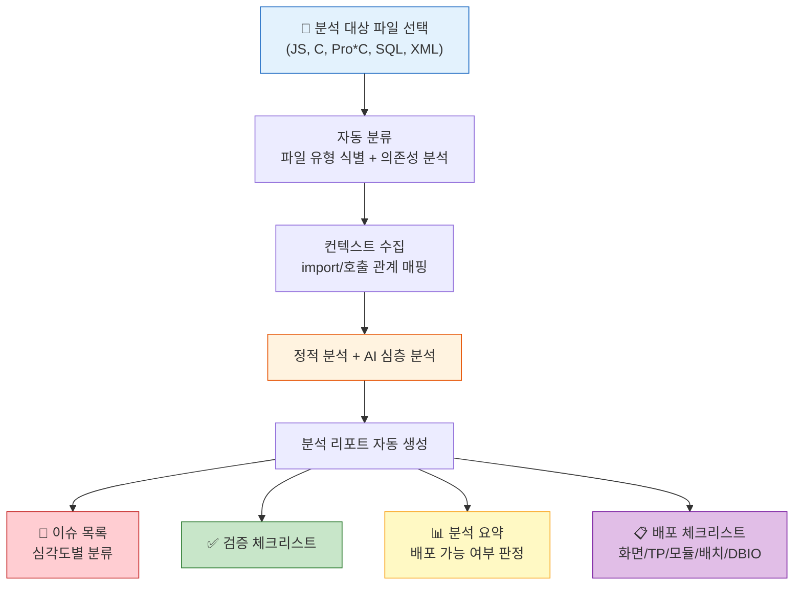
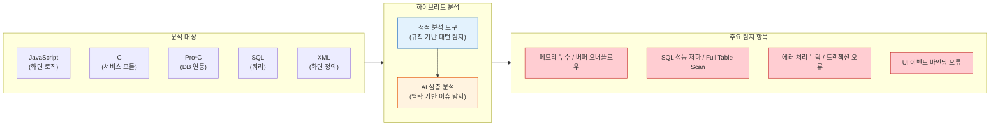
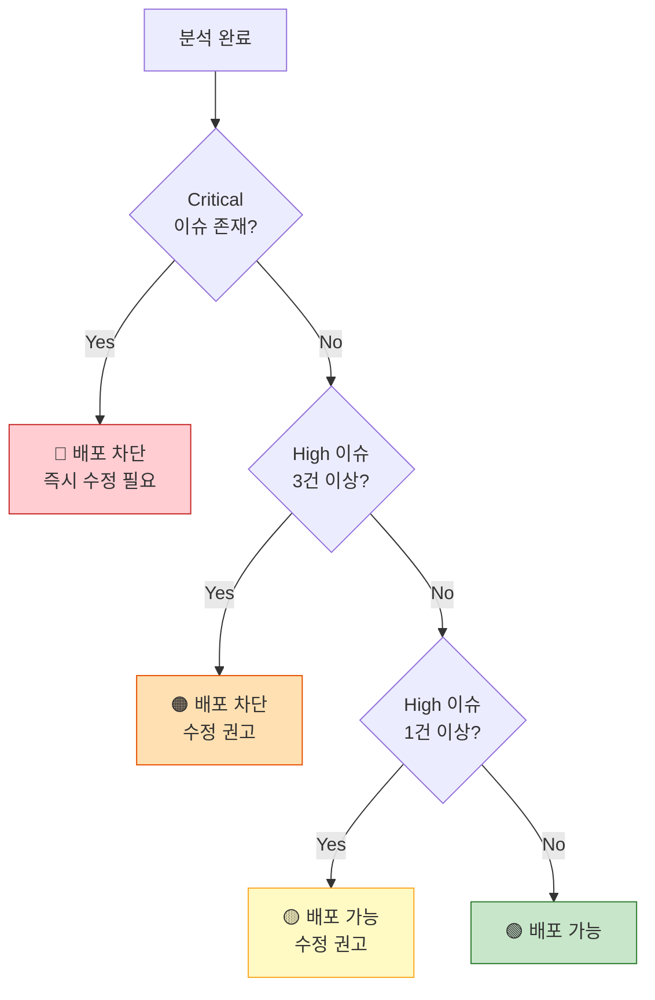

# Mider 분석 워크플로우

## 전체 분석 흐름

```mermaid
flowchart TB
    A["📁 분석 대상 파일 선택\n(JS, C, Pro*C, SQL, XML)"] --> B["자동 분류\n파일 유형 식별 + 의존성 분석"]
    B --> C["컨텍스트 수집\nimport/호출 관계 매핑"]
    C --> D["정적 분석 + AI 심층 분석"]
    D --> E["분석 리포트 자동 생성"]

    E --> F["🔴 이슈 목록\n심각도별 분류"]
    E --> G["✅ 검증 체크리스트"]
    E --> H["📊 분석 요약\n배포 가능 여부 판정"]
    E --> I["📋 배포 체크리스트\n화면/TP/모듈/배치/DBIO"]

    style A fill:#e3f2fd,stroke:#1565c0
    style D fill:#fff3e0,stroke:#e65100
    style F fill:#ffcdd2,stroke:#c62828
    style G fill:#c8e6c9,stroke:#2e7d32
    style H fill:#fff9c4,stroke:#f9a825
    style I fill:#e1bee7,stroke:#7b1fa2
```

## 언어별 분석 방식

```mermaid
flowchart LR
    subgraph 입력["분석 대상"]
        JS["JavaScript\n(화면 로직)"]
        C["C\n(서비스 모듈)"]
        PC["Pro*C\n(DB 연동)"]
        SQL["SQL\n(쿼리)"]
        XML["XML\n(화면 정의)"]
    end

    subgraph 분석["하이브리드 분석"]
        direction TB
        S["정적 분석 도구\n(규칙 기반 패턴 탐지)"]
        AI["AI 심층 분석\n(맥락 기반 이슈 탐지)"]
        S --> AI
    end

    subgraph 탐지["주요 탐지 항목"]
        D1["메모리 누수 / 버퍼 오버플로우"]
        D2["SQL 성능 저하 / Full Table Scan"]
        D3["에러 처리 누락 / 트랜잭션 오류"]
        D4["UI 이벤트 바인딩 오류"]
    end

    입력 --> 분석 --> 탐지

    style S fill:#e3f2fd,stroke:#1565c0
    style AI fill:#fff3e0,stroke:#e65100
    style D1 fill:#ffcdd2,stroke:#c62828
    style D2 fill:#ffcdd2,stroke:#c62828
    style D3 fill:#ffcdd2,stroke:#c62828
    style D4 fill:#ffcdd2,stroke:#c62828
```

## 배포 판정 기준

```mermaid
flowchart TB
    A["분석 완료"] --> B{"Critical\n이슈 존재?"}
    B -->|Yes| C["🔴 배포 차단\n즉시 수정 필요"]
    B -->|No| D{"High 이슈\n3건 이상?"}
    D -->|Yes| E["🟠 배포 차단\n수정 권고"]
    D -->|No| F{"High 이슈\n1건 이상?"}
    F -->|Yes| G["🟡 배포 가능\n수정 권고"]
    F -->|No| H["🟢 배포 가능"]

    style C fill:#ffcdd2,stroke:#c62828
    style E fill:#ffe0b2,stroke:#e65100
    style G fill:#fff9c4,stroke:#f9a825
    style H fill:#c8e6c9,stroke:#2e7d32
```
