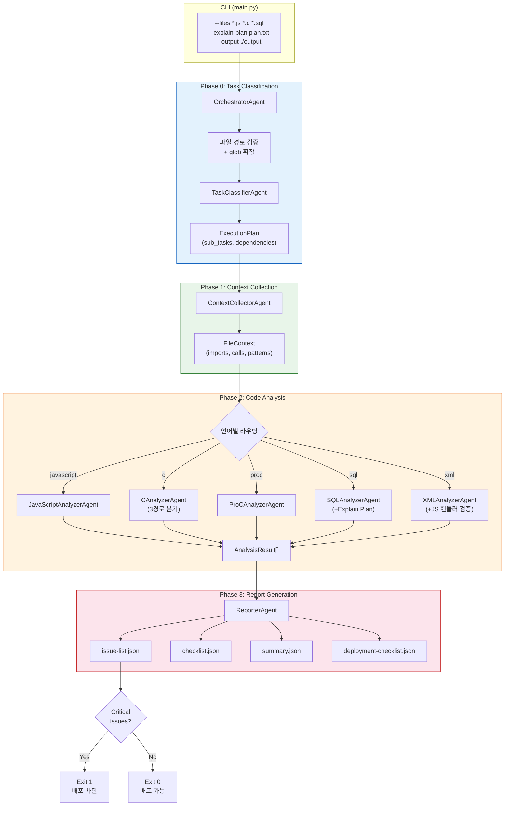
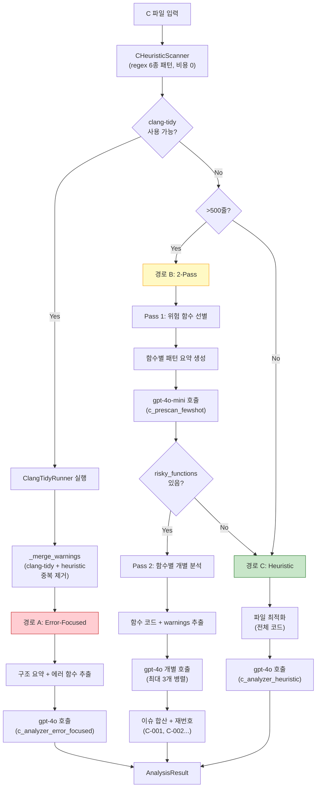
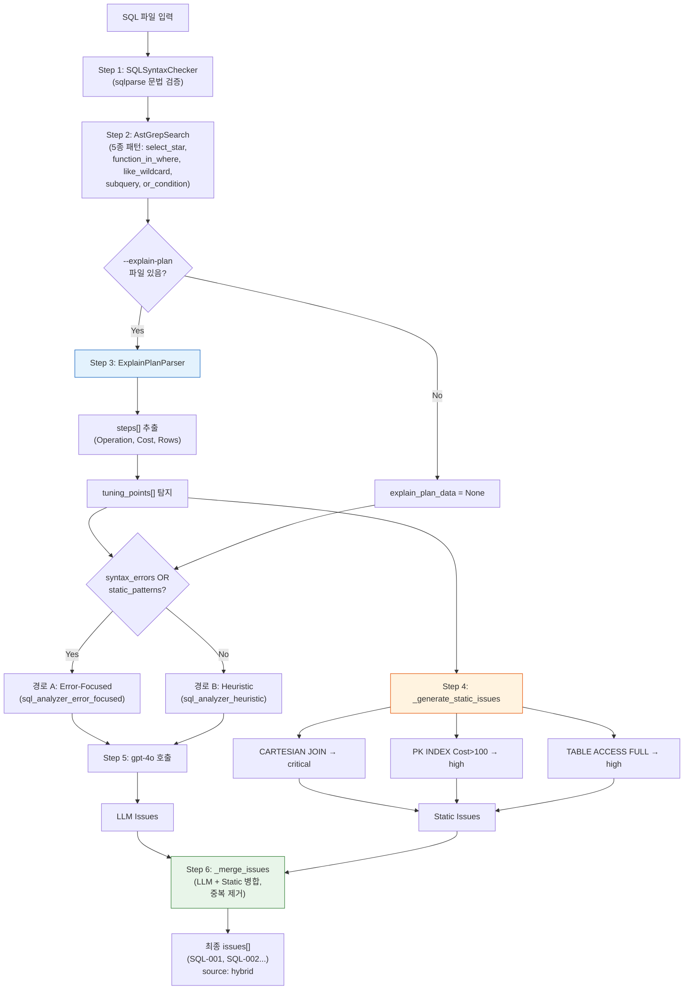
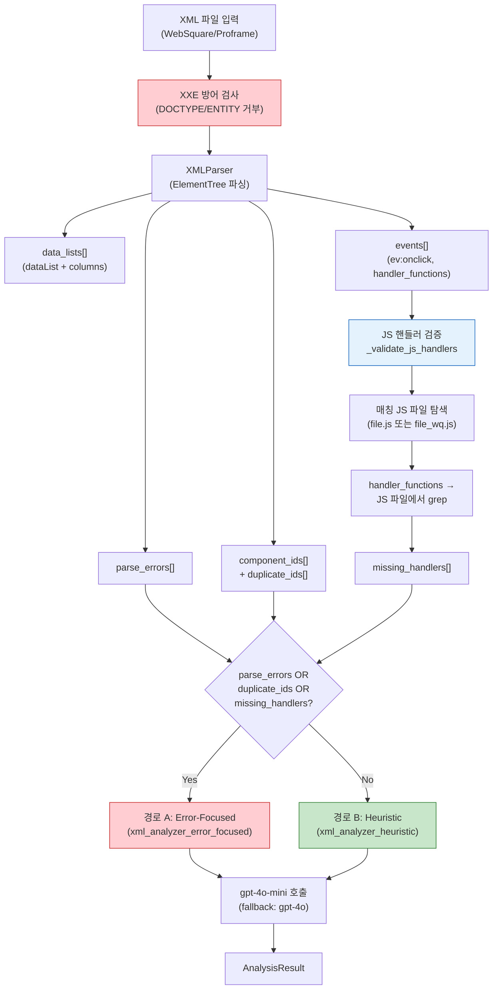
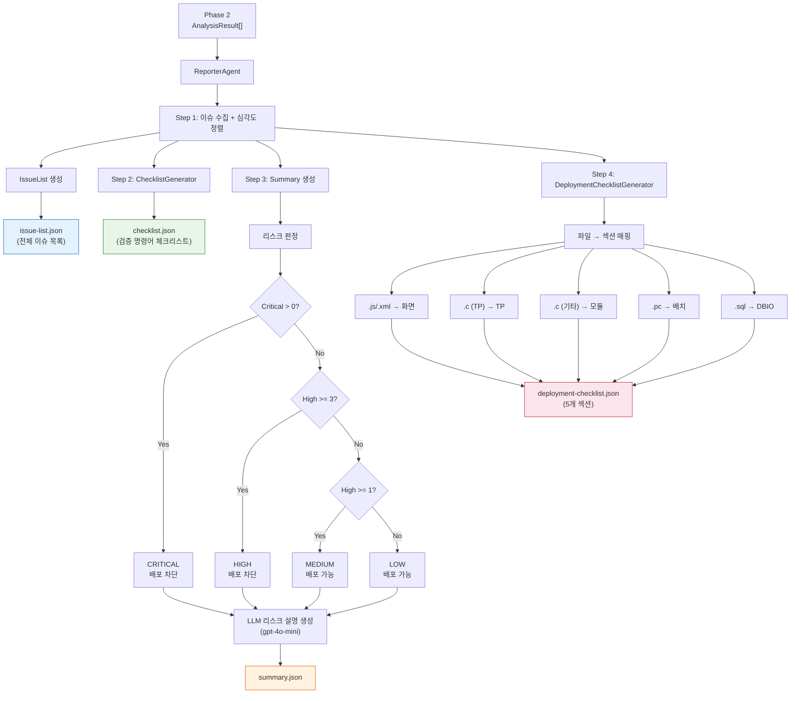
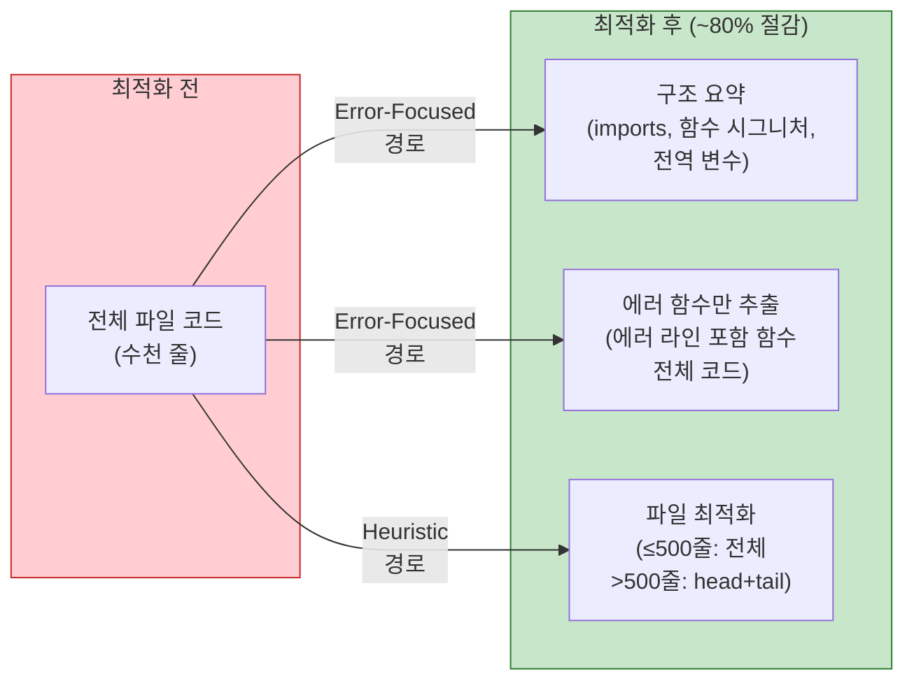
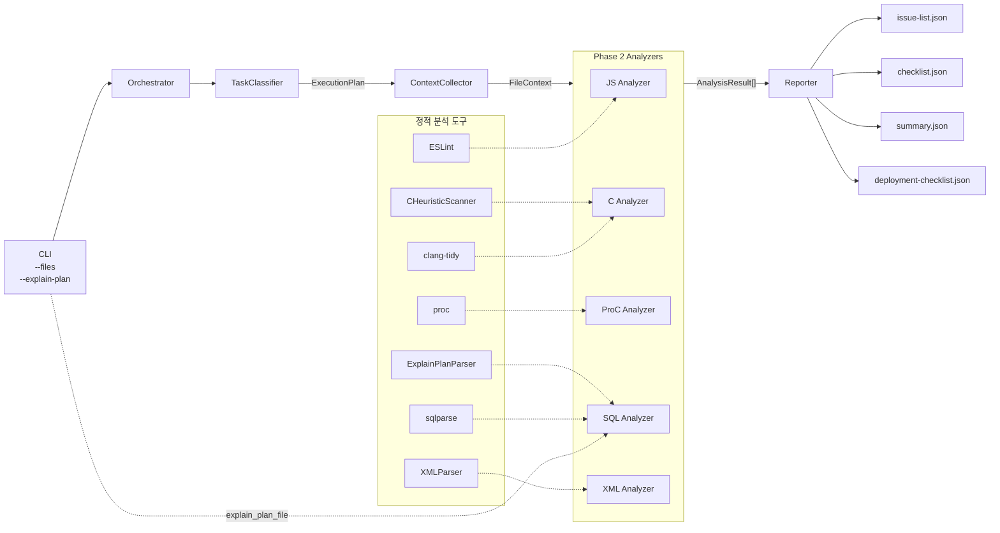

# Mider Workflow Diagrams

## 1. 전체 파이프라인 (Overall Pipeline)

## 2. CAnalyzerAgent 워크플로우 (3경로 분기)

## 3. SQLAnalyzerAgent 워크플로우 (Explain Plan + 정적 이슈)

## 4. XMLAnalyzerAgent 워크플로우

## 5. ReporterAgent 워크플로우 (4개 출력)

## 6. 토큰 최적화 전략

## 7. 데이터 흐름 요약

